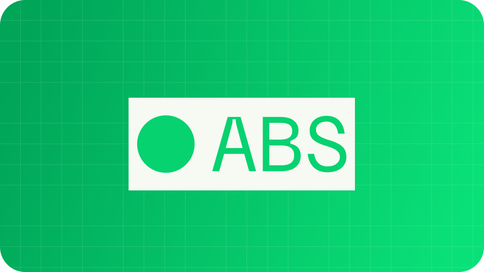

# Developer Platform

<h2 align="center">Welcome to Abstract Names</h2>

<p align="center">Learn more about Abstract Names or how to integrate .abs names in your project.</p>

<p align="center"><a href="https://abstractnames.xyz/" class="button primary">Join the waitlist</a> <a href="https://x.com/abstractnamesX" class="button secondary">Follow on X</a></p>

<table data-view="cards"><thead><tr><th></th><th></th><th></th><th data-hidden data-card-target data-type="content-ref"></th><th data-hidden data-card-cover data-type="files"></th></tr></thead><tbody><tr><td><h4><i class="fa-book">:book:</i></h4></td><td><strong>Learn about .abs names</strong></td><td>Discover what Abstract Names are, how to get one and how they work.</td><td><a href="https://app.gitbook.com/o/1lxjAgozqBuPDv56Tqgl/s/6coB22TaqfbUfxw7JAUV/">Documentation</a></td><td><a href=".gitbook/assets/docs.png">docs.png</a></td></tr><tr><td><h4><i class="fa-square-code">:square-code:</i></h4></td><td><strong>Builder toolkit</strong></td><td>Get started with the developer toolkit in less then 5 minutes.</td><td><a href="https://app.gitbook.com/o/1lxjAgozqBuPDv56Tqgl/s/6coB22TaqfbUfxw7JAUV/">Documentation</a></td><td><a href=".gitbook/assets/code.png">code.png</a></td></tr><tr><td><h4><i class="fa-clock-rotate-left">:clock-rotate-left:</i></h4></td><td><strong>Changelog</strong></td><td>Keep track of changes and updates.</td><td><a href="https://app.gitbook.com/o/1lxjAgozqBuPDv56Tqgl/s/vGjTHdfhEuWoCvkQllLP/">Changelog</a></td><td><a href=".gitbook/assets/changelog.png">changelog.png</a></td></tr></tbody></table>



### Learn more about the Abstract Names

Read guides, watch tutorials, and learn more about Abstract Names as the identity layer on for your Abstract Global Wallet.

<a href="https://app.gitbook.com/o/1lxjAgozqBuPDv56Tqgl/s/0mhf1kTl5vcCvLSpeXu2/" class="button primary" data-icon="book-open">Guides</a> <a href="https://app.gitbook.com/o/1lxjAgozqBuPDv56Tqgl/s/6coB22TaqfbUfxw7JAUV/" class="button secondary" data-icon="book">Documentation</a>



<figure><figcaption></figcaption></figure>






```javascript
// Import the SDK
import ExampleAPI from "example-api";

// Initialize the client
const client = new ExampleAPI({ apiKey: "YOUR_API_KEY" });

// Send your first message
const response = await client.messages.send({
  message: "Hello, world!"
});

```




### Get started in 5 minutes

Setting up your first .ABS resolution call should be the easiest part of getting started. With our clear easy SDK, copy-paste-ready examples, and quick authentication, you’ll be up and running in minutes—not hours.

No guesswork, no complexity—just your first successful call, fast.

<a href="https://app.gitbook.com/o/1lxjAgozqBuPDv56Tqgl/s/6coB22TaqfbUfxw7JAUV/" class="button primary" data-icon="rocket-launch">Get started</a> <a href="https://app.gitbook.com/o/1lxjAgozqBuPDv56Tqgl/s/WSsA6Y5u15x5OBIftssT/" class="button secondary" data-icon="terminal">Install SDK</a>



<h2 align="center">Join a community of over 3,000 users</h2>

<p align="center">Join our Discord community or create your first PR in just a few steps.</p>

<table data-card-size="large" data-view="cards"><thead><tr><th></th><th></th><th></th><th></th><th data-hidden data-card-cover data-type="image">Cover image</th></tr></thead><tbody><tr><td><h4><i class="fa-discord">:discord:</i></h4></td><td><strong>Discord community</strong></td><td>Join our Discord community to post questions, get help, and share resources with over 3,000 Abstract community members.</td><td><a href="https://www.gitbook.com/" class="button secondary">Join Discord</a></td><td><a href=".gitbook/assets/discord.png">discord.png</a></td></tr><tr><td><h4><i class="fa-github">:github:</i></h4></td><td><strong>GitHub</strong></td><td>Our product is 100% open source and built by developers just like you. Head to our GitHub repository to learn how to submit your first PR.</td><td><a href="https://www.gitbook.com/" class="button secondary">Submit a PR</a></td><td><a href=".gitbook/assets/github.png">github.png</a></td></tr></tbody></table>
