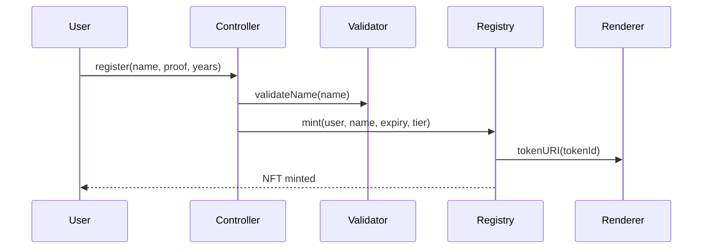
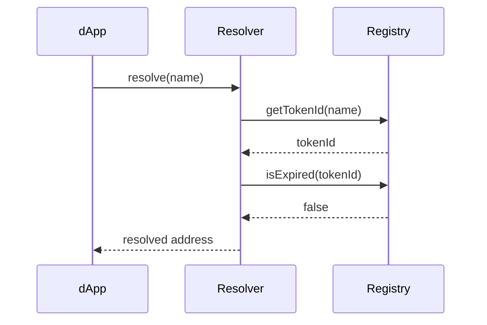

# Architecture

Abstract Names is built as a modular system of five interconnected smart contracts, each handling specific responsibilities. This architecture ensures security, upgradability, and clear separation of concerns.

### Architecture Overview

```
┌─────────────────┐    ┌─────────────────┐     ┌─────────────────┐
│   Controller    │────│    Registry     │────>│    Renderer     │
│   (Pricing &    │    │   (Ownership    │     │   (NFT SVG &    │
│   Registration) │    │   & Core NFT)   │     │   Metadata)     │
└─────────────────┘    └─────────────────┘     └─────────────────┘
         │                       │
         │                       │
         ▼                       ▼
┌─────────────────┐    ┌─────────────────┐
│   Validator     │    │    Resolver     │
│   (Name Format  │    │   (Address &    │
│   Validation)   │    │   Metadata)     │
└─────────────────┘    └─────────────────┘
```

### Contract Overview

| Contract   | Purpose                | Key Features                                  |
| ---------- | ---------------------- | --------------------------------------------- |
| Registry   | Core ERC-721 ownership | Name-to-tokenId mapping, expiration tracking  |
| Controller | Registration & pricing | Multi-phase launch, tier pricing, renewals    |
| Resolver   | Resolution & metadata  | Forward/reverse resolution, text records      |
| Validator  | Name validation        | Multi-language support, format checking       |
| Renderer   | NFT artwork            | Dynamic SVG generation, tier-specific designs |

### Modular Design Benefits

#### Security

* **Separation of concerns** - Each contract has a single responsibility
* **Limited permissions** - Role-based access control between contracts
* **No single point of failure** - Issues in one contract don't affect others

#### Upgradability

* **Component replacement** - Individual contracts can be upgraded independently
* **Feature addition** - New functionality through additional contracts
* **Configuration flexibility** - Admin functions for component addresses

#### Gas Efficiency

* **Optimized operations** - Each contract optimized for its specific purpose
* **Batch operations** - Efficient multi-name operations where applicable
* **Minimal storage** - Efficient data structures and storage patterns

### Key Interactions

#### Name Registration Flow



#### Name Resolution Flow



### Interface Standards

All contracts implement comprehensive interfaces defining their public APIs:

* `IAbstractNamesRegistry` - Core ownership and name management
* `IAbstractNamesController` - Registration and pricing functions
* `IAbstractNamesResolver` - Resolution and metadata functions
* `INameValidator` - Name validation functions
* `INamesRendererSVG` - NFT rendering functions
